# GriDSSPack data flow: PSS/E RAW input to final result files

This guide traces the current GriDSSPack contingency-analysis executable from a
PSS/E `.raw` network file to its final CSV files. It was checked against the
current worktree at commit `202273b18538f75d97423cb30596d493a209f538`, including
the present uncommitted runtime source changes. It describes retained behavior
only.

Editable companion: [GriDSS RAW-to-CSV flowchart set in FigJam](https://www.figma.com/board/DwHQJjOSbkqNpxji0GJClC).

## Executive summary

The `.raw` file is not sent directly to a solver or to the GPU. An XML input deck
points to the file and supplies solver, contingency, GPU, filtering, and output
policy. A version-specific PSS/E parser turns the text records into typed bus,
generator, load, line, transformer, and metadata records. GridPACK turns those
records into a live network graph and first solves the recorded pre-contingency
**base case**, including any equipment already marked out of service. If
that solve fails, contingency analysis stops.

Each contingency is then just an instruction to open one or more circuits or
generators in a task group's private, repeatedly reused network replica. A
world-wide task manager dynamically hands event numbers to MPI task groups.
When the accelerated path is usable,
each rank reserves a bounded **wave** of events, screens them, and sends only
fixed-structure branch outages to a reusable cuDSS workspace. Generator outages,
islanding or structure-changing outages, failed accelerated solves, and cases
that require controller action go through the ordinary per-case/status path.
That path skips Newton for invalid or islanded setups and otherwise invokes the
full configured power-flow solve.

The current “batch” is therefore a scheduling, state-storage, and sparse-pattern
reuse unit. Eligible cases are advanced **sequentially**, not simultaneously, in
one single-system cuDSS workspace. One symbolic analysis is shared across the
wave; each case retains its own voltages, mismatch, numerical factorization
and refresh state, convergence result, and final output state.

Successful cases produce electrical-result rows. In a normally finalized run,
every processed event, successful or not, produces one convergence/status row.
The default output is
`csv_flat`, which produces `<prefix>_flat.csv`, `<prefix>_buses.csv`, and
`<prefix>_convergence.csv`.

## Terms used below

| Term | Plain-language meaning |
|---|---|
| **Bus** | A connection point whose voltage magnitude and phase angle are solved. |
| **Branch/circuit** | A transmission line or transformer connecting two buses. Several circuit IDs can share one bus pair. |
| **Contingency** | A hypothetical outage of one or more circuits or generators. “N-1” means selecting one recorded element for removal from the base network. |
| **Base case** | The RAW network's solved operating point before GriDSSPack applies a simulated outage; RAW statuses can already mark equipment off. |
| **Slack/reference bus** | The bus that sets the angle reference and absorbs the residual real/reactive-power imbalance needed to balance the equations. |
| **Island** | A disconnected portion of the grid. More than one energized connected component cannot be handled as one ordinary power-flow case here. |
| **PV / PQ bus** | A generator-controlled bus contributes one reduced equation/unknown; a load-style bus contributes two. A reference or isolated bus contributes none. These counts determine the reduced matrix shape. |
| **YBus / SBus** | YBus encodes electrical connections and admittances; SBus encodes scheduled net power injection, broadly generation minus demand. |
| **Mismatch** | The difference between scheduled and calculated real/reactive power at the current voltages. Convergence means its largest retained component is at or below the configured tolerance. |
| **Jacobian** | A sparse matrix describing how the mismatches change when voltage angles and magnitudes change. |
| **CSR** | “Compressed sparse row,” three arrays that store only the nonzero matrix entries: row offsets, column numbers, and values. |

The standard AC Newton power-flow interpretation above is consistent with
[MATPOWER's power-flow formulation and Newton description](https://www.matpower.org/docs/manual.pdf),
but the control flow documented here comes from GriDSSPack's own source.

## 1. Master flow: input, base case, events, and dispatch

The master flow is split at the solved base state so the input failures and the
event-source branches remain readable.

```mermaid
flowchart LR
  launch["Start ca.x"] --> configChoice{"CLI deck supplied?"}
  configChoice -->|"Yes"| xmlDeck["Open supplied XML"]
  configChoice -->|"No"| defaultDeck["Open input.xml"]
  xmlDeck --> policy["Read CA, PF, GPU, output policy"]
  defaultDeck --> policy
  policy --> taskGroups["Create task groups and network replicas"]
  policy --> genericKey{"Generic networkConfiguration present?"}
  genericKey -->|"Yes: it has priority"| sniffHeader["Read RAW header REV"]
  genericKey -->|"No"| versionKey{"First version key present? v33 then v34, v35, v36"}
  versionKey -->|"Yes"| versionParser["Select keyed PTI parser"]
  versionKey -->|"No"| invalidInput["Print missing-file message; no checked recovery path"]
  sniffHeader --> versionParser
  versionParser --> parseGraph["Parse RAW records and create unpartitioned graph"]
  taskGroups --> parseGraph
  parseGraph -.->|"parse exception or unusable graph"| startupFail["Startup fails; no graceful success flag"]
  parseGraph --> phaseSign{"phaseShiftSign is -1?"}
  phaseSign -->|"Yes"| invertShift["Reverse parsed phase-shift signs"]
  phaseSign -->|"No"| partitionGraph["Partition graph; add active and ghost objects"]
  invertShift --> partitionGraph
  partitionGraph --> factoryInit["Load and initialize live PF components"]
  invalidInput -.->|"driver still calls initialize"| startupFail
  factoryInit -.->|"initialization exception"| startupFail
  factoryInit --> stageOutput["Stage metadata and output writers"]
  stageOutput --> baseSolve["Run complete base solve"]
  baseSolve --> firstBaseOk{"First solve converged?"}
  firstBaseOk -->|"No"| abortRun["MPI abort; output set incomplete"]
  firstBaseOk -->|"Yes"| extraBaseQ{"CA Q-limit check changes state?"}
  extraBaseQ -->|"No or disabled"| baseCapture["Capture solved base state"]
  extraBaseQ -->|"Yes"| secondBase["Run one additional full solve"]
  secondBase --> secondBaseOk{"Second solve converged?"}
  secondBaseOk -->|"No"| abortRun
  secondBaseOk -->|"Yes"| baseCapture

  classDef input fill:#dbeafe,stroke:#2563eb,color:#172554;
  classDef decision fill:#fef3c7,stroke:#d97706,color:#451a03;
  classDef success fill:#dcfce7,stroke:#16a34a,color:#052e16;
  classDef failure fill:#fee2e2,stroke:#dc2626,color:#450a0a;
  class xmlDeck,defaultDeck,sniffHeader,versionParser input;
  class configChoice,genericKey,versionKey,phaseSign,firstBaseOk,extraBaseQ,secondBaseOk decision;
  class baseCapture success;
  class invalidInput,startupFail,abortRun failure;
```

```mermaid
flowchart LR
  baseCapture["Solved base state"] --> branchAuto{"FullBranchN1?"}
  branchAuto -->|"Yes"| addBranches["Enumerate serialized circuits"]
  branchAuto -->|"No"| generatorAuto{"FullGeneratorN1?"}
  addBranches --> generatorAuto
  generatorAuto -->|"Yes"| addGenerators["Enumerate serialized generators"]
  generatorAuto -->|"No"| autoDone["Auto list complete"]
  addGenerators --> autoDone
  autoDone --> namedFile{"Named contingencyList supplied?"}
  namedFile -->|"Yes"| openFile["Open selected contingency XML"]
  namedFile -->|"No"| anyAuto{"Either auto flag enabled?"}
  anyAuto -->|"Yes"| orderedEvents["Ordered events vector"]
  anyAuto -->|"No"| openDefault["Open contingencies.xml"]
  openDefault --> openFile
  openFile --> fileOk{"File opened?"}
  fileOk -->|"No"| preserveList["Keep auto list or empty list"]
  fileOk -->|"Yes"| parseEvents["Keep valid Line and Generator entries"]
  parseEvents --> hadAuto{"Either auto flag enabled?"}
  hadAuto -->|"Yes"| mergeEvents["Append nonduplicate trip sets"]
  hadAuto -->|"No"| orderedEvents
  mergeEvents --> orderedEvents
  preserveList --> orderedEvents
  orderedEvents --> taskManager["Initialize dynamic TaskManager with N tasks"]
  taskManager --> eventsEmpty{"N equals zero?"}
  eventsEmpty -->|"Yes"| baseOnly["No task IDs; use common finalization"]
  eventsEmpty -->|"No"| batchGate{"Wave gate passes?"}
  batchGate -->|"Yes"| wavePath["Claim bounded waves"]
  batchGate -->|"No"| exactPath["Claim one per-case task at a time"]

  classDef decision fill:#fef3c7,stroke:#d97706,color:#451a03;
  classDef success fill:#dcfce7,stroke:#16a34a,color:#052e16;
  classDef fallback fill:#ffedd5,stroke:#ea580c,color:#431407;
  class branchAuto,generatorAuto,namedFile,anyAuto,fileOk,hadAuto,eventsEmpty,batchGate decision;
  class orderedEvents,taskManager,wavePath,exactPath success;
  class preserveList,baseOnly fallback;
```

### 1.1 Configuration and network replication

`ca.x` initializes MPI, Global Arrays, and GridPACK's math layer, then calls
`CADriver::execute()`. The first command-line argument is the XML deck; without
one, the driver opens `input.xml`. The XML is read collectively on the world
communicator. It is the XML—not the RAW file—that selects convergence tolerance,
iteration limits, controllers, event sources, GPU behavior, output format, and
monitoring filters.

`groupSize` defaults to 1. The MPI world is divided into independent task
communicators, and each task communicator receives its own `PFNetwork` replica.
If `groupSize>1`, that replica is partitioned among the members of the task
group. The retained wave engine requires `groupSize=1`, so in that mode **every
MPI rank owns a complete network** and works on different event IDs.

Source: [`ca_main.cpp`](src/applications/contingency_analysis/ca_main.cpp),
[`CADriver::execute()`](src/applications/contingency_analysis/ca_driver.cpp#L357),
and [`Configuration::open()`](src/configuration/configuration.cpp#L95).

### 1.2 RAW parsing and the live network

The generic `networkConfiguration` key has first priority. If it exists, any
version-specific key is ignored: selection starts as v23 and inspects the first
non-`@` header line. A non-comma header stays v23; RAW revision 30–33 uses the
v33 parser, revision 34 uses v34, revision 35 uses v35, and revision 36 or later
uses v36. Only when the generic key is absent does the code check explicit keys,
in the order `networkConfiguration_v33`, `_v34`, `_v35`, then `_v36`, and select
the first one found.

Within each task communicator, rank 0 parses the case header and the bus, load,
fixed-shunt, generator, branch, transformer, area, zone, owner, switched-shunt,
and related blocks into keyed `DataCollection` records. Those records preserve
bus numbers, circuit IDs, equipment status, impedances, taps/phase shifts,
generator/load values, limits, A/B/C ratings, and names. Component records
initially reside on the parsing rank, `createNetwork()` creates bus and branch
objects there, and `network->partition()` then
shuffles active objects and their `DataCollection`s to their owners. Case
ID/system MVA are collectively replicated with an all-reduce, while network-
level metadata is broadcast from rank 0. Partitioning assigns active components,
adds the boundary “ghost”
copies needed by another partition, reconstructs endpoints/neighbors, and binds
branches to their buses.

If `phaseShiftSign` is exactly `-1`, the selected PTI parser reverses transformer
phase-shift signs before the live network is used; its default is `+1`.

The power-flow factory then loads numeric fields into live `PFBus` and
`PFBranch` state, assigns vector/matrix indices, builds exchange buffers, and
synchronizes remote-regulation information. RAW voltage magnitude and angle are
the ordinary reset/start values; phase angles are converted to radians inside
the component.

There is no alternate parser fallback or `parseOk` Boolean after a missing or
unusable network path. `readNetwork()` can print and return without a graph, or a
parser can throw, while the driver unconditionally proceeds to `initialize()`;
a valid XML/RAW pair is therefore a run precondition rather than a gracefully
handled decision. Bus parts and the flat header are staged only after network
reading and initialization return. A later failure—including base-solve
failure—can leave those partial artifacts, but not a completed result set.

Source: [`PFAppModule::readNetwork()`](src/applications/modules/powerflow/pf_app_module.cpp#L86),
[`PTI33_parser::getCase()`](src/parser/PTI33_parser.hpp#L200),
[`BaseParser::createNetwork()`](src/parser/base_parser.hpp#L50), and
[`PFAppModule::initialize()`](src/applications/modules/powerflow/pf_app_module.cpp#L359).

### 1.3 Metadata and writers are staged early

Before solving, the driver builds area/zone/owner name maps, bus metadata, and
circuit-keyed rating maps. For `csv_flat` and `csv_delta`, every world rank writes
a temporary bus-metadata part. It also reads the optional branch allowlist and
area/kV filters. If a successfully parsed allowlist contains at least one key,
it overrides the area/kV filters. A missing, empty, or keyless file leaves the
area/kV gates in effect. These choices affect reporting only; they do not remove
equipment from the electrical model or from contingency screening.

### 1.4 The base-case hard gate

Every task communicator solves its recorded pre-contingency network. In wave mode this one-off
solve deliberately uses the established PETSc/CPU sparse-direct path, avoiding
cuDSS setup that cannot be amortized across cases.

At the center of a solve is Newton–Raphson:

1. construct YBus and scheduled injections;
2. evaluate the nonlinear mismatch vector `F(x)` at the current voltage state;
3. form the sparse Jacobian `J(x)`;
4. solve the linear correction equation `J(x) Δx = F(x)`;
5. optionally damp `Δx`, update voltage angle/magnitude, and exchange ghost-bus
   values;
6. rebuild the true mismatch and Jacobian until tolerance, failure, or the
   iteration cap.

Around that inner loop are remote-voltage regulation, generator reactive limits
(including PV-to-PQ conversion), switched shunts, and load-tap-changing
transformers. Area-interchange control, when enabled, is an outer loop that
adjusts area slack generation and repeats. A solve returns failure on a linear
solver exception, iteration exhaustion, or mismatch growth beyond 100 times its
starting value. Reaching a controller or area-control cap stops repeating without
assigning `DIVERGED`; the final controller or area adjustment may therefore be
accepted without another Newton solve.

The base solve is a hard gate. Failure or exception causes `MPI_Abort`; no
contingency is evaluated. On success, base-case voltage violations are marked so
they are not later blamed on an outage. Ordinary CSV/JSON stores a structured
base result, flat CSV emits event 0 named `base_case` only once, and delta mode
caches base branch/voltage values on every rank for later joins.

`Powerflow/qlim` controls the controller loop inside `solve()`. The separate
`Contingency_analysis/qlim` flag controls PFBus reporting and the driver's
post-solve Q-limit check, but it is not output-only: it is installed before
component loading. On a warm start it can change whether a generator bus begins
at its voltage setpoint and can pre-convert a PV bus whose scheduled reactive
power is at a limit into a PQ bus, changing the initial equation structure. If
the driver-level check changes the base state, the driver runs exactly one
additional full solve and uses its return value for the hard gate. Decks should
keep the two Q-limit settings aligned.

Source: [`PFAppModule::solve()`](src/applications/modules/powerflow/pf_app_module.cpp#L419)
and the base gate in [`ca_driver.cpp`](src/applications/contingency_analysis/ca_driver.cpp#L1385).

### 1.5 Event construction and scheduling

The event vector can come from either or both of these paths:

- `FullBranchN1` and `FullGeneratorN1` are independent. The first enumerates
  serialized circuit IDs; the second enumerates serialized generator IDs; when
  both are true, both classes are appended. This is not an in-service-only
  eligibility filter: serialized base-off elements can also become one-element
  instructions, and later logic preserves their base-off status rather than
  energizing them.
- `contingencyList` selects an external XML file. If neither auto-generation nor
  a named file is configured, `contingencies.xml` is used. A Line entry can name
  multiple bus-pair/circuit triples and a Generator entry can name multiple
  bus/generator pairs, so N-k events are supported. Entries whose ID counts do
  not match, lack a recognized type, or use anything other than the exact
  case-sensitive types `Line` and `Generator` are omitted. Failure to open an
  additional file leaves an auto-generated list unchanged; in file-only mode it
  leaves an empty list.

When sources are combined, equal directed trip sets of the same type are removed
without depending on element order. A reversed `(to,from,circuit)` identity is
not treated as the same duplicate as `(from,to,circuit)`. The resulting vector position fixes `event_idx`
(base is 0; contingencies are 1 through N). `TaskManager` distributes those IDs
dynamically; it does not move the network between ranks.

Auto-generation gathers serialized strings only on task-communicator rank 0.
With the supported/default `groupSize=1`, every world rank is such a root and
builds the same list. No later event-vector broadcast is visible for
`groupSize>1`; auto-generated lists in that configuration should not be assumed
consistent across task-group members. A zero-event list is legal: the driver
still constructs `TaskManager` with zero tasks and runs common setup/finalization,
but receives no event IDs. In default flat mode the base-case `_flat.csv` and
populated `_buses.csv` remain; only `_convergence.csv` is header-only. In delta
mode `_buses.csv` is populated while `_delta.csv` and `_convergence.csv` are
header-only. Other formats follow their base-case treatment in section 5.2.

Source: [`generateN1Contingencies()`](src/applications/contingency_analysis/ca_driver.cpp#L184),
[`getContingencies()`](src/applications/contingency_analysis/ca_driver.cpp#L85),
and event-list construction in [`ca_driver.cpp`](src/applications/contingency_analysis/ca_driver.cpp#L1446).

## 2. Global acceleration gate and initial eligibility screen

The wave path is active only when all five conditions are true:

```text
GPU.enabled
AND GPU.batched
AND cuDSS is compiled and a CUDA device is visible
AND groupSize == 1
AND Powerflow.AreaInterchange == false
```

The CA-level Q-limit flag (`Contingency_analysis/qlim`), switched-shunt, and LTC
options do not disable waves because retained cases are checked for those
actions after the accelerated solve. `Powerflow/qlim=true` alone neither disables
waves nor activates the post-wave CA Q-limit check. It still governs the base
solve and every immediate or fallback `PFAppModule::solve()` call, but not a
retained accelerated case for which `solve()` is skipped. Area interchange does
disable waves because there is no equivalent per-case post-wave check.

The default wave size is 8; `auto` currently also means 8. A numeric value must
be positive and is capped at the smaller of 256 cases and the number of complete
voltage/angle snapshots that fit in 256 MiB per rank.

Backend selection has a subtle current-code consequence. GPU disabled selects
PETSc. GPU enabled with non-batched mode requests the scalar cuDSS backend and
resolves back to PETSc if unavailable. A batched request when cuDSS is
unavailable follows that same request-then-resolution route to PETSc. GPU enabled
with batched mode and available cuDSS deliberately selects PETSc for
base/fallback calls because the wave invokes cuDSS directly. That PETSc choice happens before the later
`groupSize`/area gate; therefore a requested wave that is later disabled by
`groupSize!=1` or area interchange actually runs per-case PETSc, despite a
console message that calls it a per-contingency GPU path. Although the block
parses `Powerflow/LinearSolver/Backend`, that string does not participate in this
CA selection; `GPU.enabled`, `GPU.batched`, and cuDSS availability control it.

```mermaid
flowchart LR
  taskManager["Dynamic task IDs"] --> globalGate{"Wave gate passes?"}
  globalGate -->|"No"| perCasePath["Immediate per-case/status path"]
  globalGate -->|"Yes"| assemblerInit["Build persistent assembler"]
  assemblerInit --> initOk{"Initialization valid?"}
  initOk -->|"No"| unhealthy["Mark rank unhealthy"]
  initOk -->|"Yes"| claimWave["Claim up to waveSize IDs"]
  unhealthy --> claimWave
  claimWave --> rankHealthy{"Rank still wave-healthy?"}
  rankHealthy -->|"No"| exactQueue["Put every claimed ID on per-case list"]
  rankHealthy -->|"Yes"| restoreWave["Restore base state; verify structure signature"]
  restoreWave --> waveReady{"Wave state valid?"}
  waveReady -->|"No"| waveFailure["Mark rank unhealthy"]
  waveFailure --> exactQueue
  waveReady -->|"Yes"| inspectTask["Inspect next event"]
  inspectTask --> fastBranch{"Fast assembler and branch event?"}
  fastBranch -->|"No"| exactQueue
  fastBranch -->|"Yes"| simpleKnown{"One resolved circuit in bridge map?"}
  simpleKnown -->|"Yes"| isBridge{"Circuit is a bridge?"}
  isBridge -->|"Yes"| exactQueue
  isBridge -->|"No"| gpuSubset["GPU-eligible subset"]
  simpleKnown -->|"No"| fullProbe["Apply full topology probe"]
  fullProbe --> probePass{"Found, slack valid, connected, no lone bus, same signature?"}
  probePass -->|"No"| exactQueue
  probePass -->|"Yes"| gpuSubset
  gpuSubset --> solveWave["Continue to accelerated solve flow"]

  classDef decision fill:#fef3c7,stroke:#d97706,color:#451a03;
  classDef fast fill:#dcfce7,stroke:#16a34a,color:#052e16;
  classDef fallback fill:#ffedd5,stroke:#ea580c,color:#431407;
  class globalGate,initOk,rankHealthy,waveReady,fastBranch,simpleKnown,isBridge,probePass decision;
  class gpuSubset,solveWave fast;
  class perCasePath,exactQueue,unhealthy,waveFailure fallback;
```

### 2.1 What the persistent assembler precomputes

Once per rank, after the base case is solved, `GridpackBatchAssembler`:

- captures either the solved base voltages (`warmStart=true`, the default) or
  the original RAW/reset voltages (`warmStart=false`);
- rebuilds base YBus/SBus and the reduced mismatch/Jacobian mappers;
- records the exact base CSR row offsets and column indices and validates that
  dimensions and indices fit cuDSS's 32-bit interface;
- records each bus's 0/1/2-equation structure signature;
- in normal fast mode, maps every bus/branch component block to its exact CSR
  value slots; and
- optionally builds the connectivity screen.

Construction failure permanently marks that rank unhealthy for waves; it can
still claim and solve exact tasks. `GRIDPACK_BATCH_NOFAST` intentionally routes
all events to the established exact path. `GRIDPACK_BATCH_VALIDATE` instead runs
the fast path while comparing requested Jacobian/RHS assemblies with GridPACK's
canonical mapper, including the CSR structure and numeric values at a relative
scale of `1e-12`; disagreement throws and fails the wave closed.

### 2.2 Screening decisions

At every wave boundary the assembler restores base circuit statuses, starting
voltages, and YBus/SBus, then verifies that the live 0/1/2-equation signature
still equals the recorded base signature. It cannot repair a changed bus type;
a mismatch fails the wave. Each task is then classified:

1. A generator event is not eligible because it can change power scheduling,
   slack choice, and bus equation type.
2. For a branch event, the code resolves the requested circuit objects and
   captures their **base** status before opening them. Restoration therefore
   does not accidentally energize a circuit that was already off in the RAW
   case.
3. For exactly one resolved circuit known to the connectivity map, a non-bridge
   is immediately eligible and a bridge is sent to the exact path. A bridge is
   an edge whose removal disconnects the active graph.
4. Every other branch event—including multi-circuit events and screen misses—is
   actually applied, then accepted only if all elements and a valid slack are
   found, the grid has at most one island, there is no lone bus, and the
   0/1/2-equation signature still matches the base. The event is then undone.

The bridge map includes only active, non-isolated buses and in-service circuit
IDs. In-service parallel circuits have distinct edge IDs, so they protect each
other from bridge classification; a recorded parallel circuit that is base-off
does not. The shortcut is trusted only
when the active base graph itself is connected. Its iterative Tarjan traversal
classifies the graph in linear `O(V+E)` work; see the implementation in
[`pf_screen.hpp`](src/applications/modules/powerflow/pf_screen.hpp) and Tarjan's
original [linear graph-algorithm paper](https://epubs.siam.org/doi/10.1137/0201010).

Screened-out tasks are queued, not executed immediately. The driver first solves
and emits every retained accelerated state in the wave, restores base state, and
only then runs the queued direct and fallback tasks; section 3.3 shows that join.

Source: [`GridpackBatchAssembler`](src/applications/modules/powerflow/pf_batch_ca_assembler.hpp#L74)
and wave activation in [`ca_driver.cpp`](src/applications/contingency_analysis/ca_driver.cpp#L1748).

## 3. Accelerated Newton flow and fallback decisions

For a nonempty eligible subset, the driver creates one
`CuDSSBatchedSolver(n, nnz, pattern, 1)`, uploads the shared CSR structure, and
runs one symbolic analysis. Eligible cases then use that workspace sequentially.
NVIDIA describes the corresponding sparse-direct phases as analysis, numerical
factorization, and solve, with analysis reusable when the sparse structure is
unchanged ([cuDSS functions](https://docs.nvidia.com/cuda/cudss/functions.html)).

For each case, the assembler restores its saved voltages, opens its circuit(s),
and repairs only the changed branch and endpoint-bus YBus contributions. It calls
the same `PFBus`/`PFBranch` mismatch and Jacobian-value methods as the ordinary
mapper, but scatters values directly into the precomputed CSR slots. CSR values
and the mismatch move host-to-device; the correction moves device-to-host. The
damped correction updates the buses, after which the code recomputes the **true
nonlinear** mismatch.

The accelerated path is split into two numerical diagrams plus one common
post-wave screen. Exact or chord mode completes every eligible numerical case
and returns the whole status vector before any controller screen begins.

```mermaid
flowchart LR
  gpuSubset["GPU-eligible cases"] --> makeSolver["Create one-system cuDSS workspace"]
  makeSolver --> analyze["Analyze shared CSR pattern once"]
  analyze --> startCase["Restore case voltages and open circuits"]
  startCase --> nrMode{"Newton mode?"}
  nrMode -->|"Exact"| exactAssemble["Assemble current J and mismatch"]
  exactAssemble --> exactTol{"Mismatch within tolerance?"}
  exactTol -->|"Yes"| caseSuccess["Mark numerical convergence"]
  exactTol -->|"No"| exactCap{"Factor/iteration budget remains?"}
  exactCap -->|"Yes"| exactSolve["Factor current J and solve"]
  exactCap -->|"No"| caseFallback["Flag for later per-case path"]
  exactSolve --> exactWorked{"Linear solve worked?"}
  exactWorked -->|"No"| caseFallback
  exactWorked -->|"Yes"| exactUpdate["Apply damping; rebuild J and mismatch"]
  exactUpdate --> exactTol
  caseSuccess --> finishExact["Snapshot iterate and restore base topology"]
  caseFallback --> finishExact
  finishExact --> moreExact{"Another eligible case?"}
  moreExact -->|"Yes"| startCase
  moreExact -->|"No"| statusVector["Return complete numerical status vector"]
  nrMode -->|"Chord"| chordFlow["Continue to chord flow"]

  classDef decision fill:#fef3c7,stroke:#d97706,color:#451a03;
  classDef fast fill:#dcfce7,stroke:#16a34a,color:#052e16;
  classDef fallback fill:#ffedd5,stroke:#ea580c,color:#431407;
  class nrMode,exactTol,exactWorked,exactCap,moreExact decision;
  class gpuSubset,caseSuccess,finishExact,statusVector fast;
  class caseFallback fallback;
```

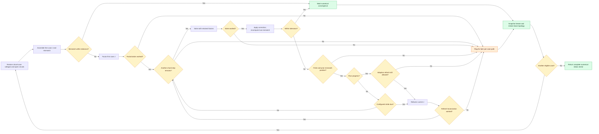

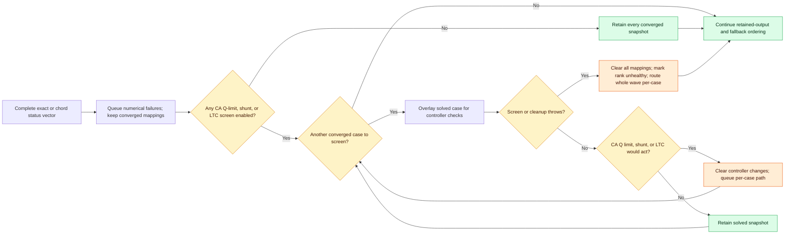

### 3.1 Exact-Newton GPU mode

When neither `constantFactor` nor `refactorEvery>1` is active, every iteration
uses the current case's current Jacobian: factor, solve, apply the correction,
then rebuild both mismatch and Jacobian. A failed cuDSS solve or failure to reach
tolerance by `maxIteration` makes the case nonconverged and sends it to the
complete CPU path.

### 3.2 Modified-Newton/chord mode

With `constantFactor=true` or `refactorEvery>1`, each case assembles its starting
mismatch; a case not already within tolerance then factors its **own first
outage-specific Jacobian** at that starting voltage. Later steps
reuse those factors while recomputing the actual nonlinear mismatch after every
correction. This is cheaper per step but ordinarily converges more slowly than
full Newton—the same tradeoff described for constant approximate Jacobians in
the MATPOWER manual cited above.

The current Jacobian is refactored after the configured stride or when

```text
new mismatch / old mismatch >= max(0.5, 1 - 0.5*damping).
```

The case falls back if factorization/solve fails, the mismatch becomes
non-finite, poor progress repeats immediately after a poor-progress refresh,
the two adaptive poor-progress refreshes are exhausted, or the chord cap is
reached. A chord result is retained only after its true mismatch satisfies the
same tolerance as exact Newton; an approximate/stalled state is never emitted.
The refresh decision is evaluated before the loop rechecks the chord cap, so a
stride or poor-progress trigger on the final executed step can perform a
factorization that is never used before the case falls back.

### 3.3 Post-wave accuracy screen, ordering, and failure scope

When at least one relevant controller is enabled, each converged accelerated
state is overlaid and checked, in short-circuit order, for reactive-limit,
switched-shunt, and LTC action. Any action sends the case to the full controller
solve. Controller changes are cleared before the next case. With all three
checks disabled, this post-screen block is skipped. Area interchange disables
waves globally because it lacks an equivalent hook.

There is no equivalent post-wave call to the full solver's remote-regulation
`adjustRemoteRegulation()` check. That is a current accuracy boundary: a retained
wave case can bypass a remote-voltage-regulation action that the full path would
have made. Also, the wave Q-limit gate uses `Contingency_analysis/qlim`, while the
full solver uses `Powerflow/qlim`; decks should keep the two settings aligned.

An individual numerical failure normally falls back only that case. An escaping
exception in preparation, analysis, assembly, solve, or controller screening
clears the entire wave, attempts to restore base state, routes all its events to
the complete per-case/status path, and marks that rank unhealthy for future
waves. An output-overlay failure similarly reruns the current event through that
path and disables later batching on that rank.

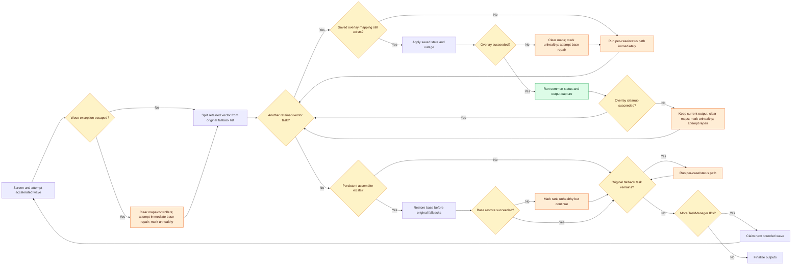

Normally the driver emits every retained overlay before the original fallback
list, because a per-case solve can rebuild caches needed by later overlays. If an
overlay fails, however, `runOneCase()` immediately attempts a base repair and
routes that current task through the per-case/status path; clearing the maps
makes each later entry in the already-built retained vector take that path
immediately as well. A cleanup failure
happens after the current output is captured, so that output is kept; maps are
cleared and later retained-vector entries take the per-case path. If an assembler
exists, the outer restore runs only after that entire vector; a failed assembler
construction skips this restore because there is no object to call. The wave's
original direct, nonconverged, and controller fallbacks then run. Failure of the
outer restore marks the rank unhealthy for later waves but does not suppress
those pending per-case paths.

Source: [`PFBatchNR::solveWave()`](src/applications/modules/powerflow/pf_batch_ca.hpp#L213),
[`GridpackBatchAssembler` live assembly](src/applications/modules/powerflow/pf_batch_ca_assembler.hpp#L462),
and [`CuDSSBatchedSolver`](src/math/cudss/cudss_batched_solver.hpp#L59).

## 4. Per-contingency status path and ordinary solve decisions

This path handles every non-wave run and every direct/fallback event. In batched
configuration, valid fallback solves use PETSc/CPU sparse LU and the full current
Jacobian. In enabled non-batched configuration, the ordinary solver can instead
use scalar cuDSS; its `constantFactor`/`refactorEvery` settings may reuse factors,
so “exact Newton” is not a correct label for every non-wave run. The surrounding
nonlinear and controller decisions are the same.

The per-case path is split into setup/Newton and controller/status diagrams.

```mermaid
flowchart LR
  caseId["Per-case event ID"] --> resetState["Reset RAW voltages and sync buses"]
  resetState --> applyOutage["Save status and apply outage"]
  applyOutage --> islandCheck{"More than one island?"}
  islandCheck -->|"Yes"| islanded["Status ISLANDED"]
  islandCheck -->|"No"| setupOk{"Elements found and slack usable?"}
  setupOk -->|"No"| noSlack["Status NO_SLACK"]
  setupOk -->|"Yes"| buildSystem["Build YBus, SBus, current mismatch and Jacobian"]
  buildSystem --> solvePending["Solve next correction X; leave it pending"]
  solvePending --> solveWorked{"Linear solve worked?"}
  solveWorked -->|"No"| linearFailure["DIVERGED; return without mapping X"]
  solveWorked -->|"Yes"| iterationGate{"Iteration count at cap?"}
  iterationGate -->|"Yes"| mapFailedX["Map pending X and sync; do not retest"]
  iterationGate -->|"No"| converged{"Current bus-state mismatch within tolerance?"}
  converged -->|"Yes"| controllerFlow["Controller checks current buses; newest X pending"]
  converged -->|"No"| applyPending["Apply pending X and synchronize buses"]
  applyPending --> rebuildSystem["Rebuild mismatch and Jacobian at updated buses"]
  rebuildSystem --> solveNext["Solve next X; leave pending; increment iteration"]
  solveNext --> nextWorked{"Linear solve worked?"}
  nextWorked -->|"No"| linearFailure
  nextWorked -->|"Yes"| stagnantQ{"Five stagnant steps and PF Q-limit action?"}
  stagnantQ -->|"Yes"| nrCap{"NR iteration cap reached?"}
  nrCap -->|"Yes"| mapFailedX
  nrCap -->|"No"| controllerFlow
  stagnantQ -->|"No"| growthCheck{"Mismatch exceeds 100 times start?"}
  growthCheck -->|"Yes"| mapFailedX
  growthCheck -->|"No"| iterationGate
  mapFailedX --> nonlinearFailure["Status DIVERGED"]
  islanded --> failureOutput["Record status and teardown"]
  noSlack --> failureOutput
  linearFailure --> failureOutput
  nonlinearFailure --> failureOutput

  classDef decision fill:#fef3c7,stroke:#d97706,color:#451a03;
  classDef success fill:#dcfce7,stroke:#16a34a,color:#052e16;
  classDef failure fill:#fee2e2,stroke:#dc2626,color:#450a0a;
  class setupOk,islandCheck,solveWorked,iterationGate,converged,nextWorked,stagnantQ,nrCap,growthCheck decision;
  class controllerFlow success;
  class noSlack,islanded,linearFailure,mapFailedX,nonlinearFailure,failureOutput failure;
```

```mermaid
flowchart LR
  controllerFlow["Current buses plus a pending correction X"] --> controllerAction{"Any IREG, Q-limit, shunt, LTC, or early-Q change?"}
  controllerAction -->|"Yes"| controllerBudget{"Controller passes remain?"}
  controllerBudget -->|"Yes"| discardPending["Discard pending X"]
  discardPending --> repeatNewton["Repeat full solve"]
  controllerBudget -->|"No"| acceptControls["Accept final mutations; mismatch may exceed tolerance"]
  acceptControls --> mapPending["Apply pending X after controller decisions; do not retest"]
  controllerAction -->|"No"| mapPending
  mapPending --> areaCheck["Evaluate area interchange"]
  areaCheck --> areaMismatch{"Area interchange outside tolerance?"}
  areaMismatch -->|"Yes"| adjustArea["Adjust area slack generation"]
  adjustArea --> areaBudget{"Area passes remain?"}
  areaBudget -->|"Yes"| repeatNewton
  areaBudget -->|"No"| extraQlim{"CA Q-limit check outcome?"}
  areaMismatch -->|"No or disabled"| extraQlim
  extraQlim -->|"Throws"| diverged["Status DIVERGED"]
  extraQlim -->|"State changed"| oneMoreSolve["Run one additional full solve"]
  oneMoreSolve --> secondThrows{"Second solve throws?"}
  secondThrows -->|"Yes"| diverged
  secondThrows -->|"No: ignore true or false return"| slackCapacity{"Slack generation within capacity?"}
  extraQlim -->|"No change or disabled"| slackCapacity
  slackCapacity -->|"No"| slackOverload["Status SLACK_OVERLOAD"]
  slackCapacity -->|"Yes"| normalResult["Check violations; status OK"]
  slackOverload --> teardown["Record status and teardown"]
  normalResult --> teardown
  diverged --> teardown

  classDef decision fill:#fef3c7,stroke:#d97706,color:#451a03;
  classDef success fill:#dcfce7,stroke:#16a34a,color:#052e16;
  classDef failure fill:#fee2e2,stroke:#dc2626,color:#450a0a;
  class controllerAction,controllerBudget,areaMismatch,areaBudget,extraQlim,secondThrows,slackCapacity decision;
  class normalResult,teardown success;
  class slackOverload,diverged failure;
```

The ordinary solver has a one-correction offset that matters when interpreting
its diagnostics. It applies the correction from the previous linear solve,
builds mismatch/Jacobian at those current buses, solves the **next** correction,
and records tolerance and runs controller decisions while that newest correction
is still pending. If a controller requires another pass, the pending correction
is discarded and the system is rebuilt with the control change. Otherwise it is
mapped to the buses only after controller checks, without recomputing mismatch
or repeating those checks. Final electrical output can therefore be one Newton
correction beyond the bus state represented by the recorded final tolerance and
controller decisions. On a mismatch-growth or iteration-cap failure, controllers
are skipped but the pending correction is still mapped before `solve()` returns
false; a linear-solver exception instead returns immediately without mapping it.
These failed states produce no physical-result rows. Also, reaching
`maxIteration` forces failure even when the mismatch measured on that same final
iteration is within tolerance.

Inside the ordinary Newton loop, five consecutive iterations whose tolerance
changes by less than `1e-10` trigger an early reactive-limit check when
`Powerflow/qlim` is enabled. If that check changes PV/PQ state before the
mismatch meets tolerance, the code breaks out with the solve return still true
and normally spends another controller pass on a fresh system. If no controller
pass remains, it can accept that mutated state with mismatch still above the
requested tolerance. If the same early break occurs at the Newton iteration
cap, the later cap check still makes the solve fail.

For each event, `runOneCase()` resets voltage magnitude/angle to the original
RAW values, synchronizes buses, and applies the outage while saving the original
equipment statuses. Applying it also checks lone buses, transfers the reference
role when necessary, and detects islands.

- A missing requested element and failure to find a usable slack both make
  `setContingency()` false. The convergence CSV does not distinguish them; when
  the case is not also islanded, both become `NO_SLACK`.
- More than one island skips Newton and takes precedence as `ISLANDED`, even if
  contingency setup also returned false.
- A lone bus makes an event ineligible for the wave, but the exact driver does
  not use `hasLoneBus` itself as a skip condition; if the island count is not
  greater than one, it attempts the full solve.
- Solver failure or nonconvergence becomes `DIVERGED`.
- A converged state whose slack generator exceeds capacity becomes
  `SLACK_OVERLOAD`.
- Only a converged state with acceptable slack capacity becomes `OK`. Voltage
  and branch-limit checks annotate that successful state; a violation does not
  change `OK` to a failure status.

After the full controller solve, the CA-level Q-limit check can request one more
solve. For the base case the second return value controls continuation. For a
contingency, the current code does not assign the second return value back to
`solveOk`; a normal false return therefore retains the first solve's success
flag. An exception is different because the surrounding driver catch sets
`solveOk=false`, producing `DIVERGED`.

On the final permitted controller pass, a controller check can mutate IREG,
Q-limit, shunt, or LTC state without scheduling another Newton solve; the pending
correction is then mapped after that decision and the state is accepted without
a mismatch/controller retest. Likewise, an out-of-tolerance area is adjusted
even on the final area pass, but that final adjustment is not followed by
another solve. These are current convergence/accuracy boundaries, not additional
fallback branches.

In scalar non-batched cuDSS mode, failure to construct/resolve that backend can
fall back to PETSc before solving. A runtime cuDSS factor/solve exception after
construction instead makes `PFAppModule::solve()` return false and produces
`DIVERGED`; unlike a batched-wave failure, it is not retried on CPU.

Finally, the driver restores original generator/circuit status, the original
slack assignment, initial shunt and LTC state, island/lone-bus bookkeeping, bus
Q-limit state, and warnings. Retained accelerated cases pass through the same
status/output/teardown function via a saved-voltage overlay. In the normal path,
all retained overlays are emitted before the original fallback list because
fallback solves can rebuild caches that the wave snapshots rely on; section 3.3
covers the immediate per-case route after an overlay or cleanup failure.

Source: [`runOneCase()`](src/applications/contingency_analysis/ca_driver.cpp#L1940),
[`PFAppModule::setContingency()`](src/applications/modules/powerflow/pf_app_module.cpp#L1396),
and [`PFAppModule::unSetContingency()`](src/applications/modules/powerflow/pf_app_module.cpp#L1526).

## 5. Result capture, I/O, and final CSVs

The first output diagram selects data; the second shows how rank-local data
becomes completed files.

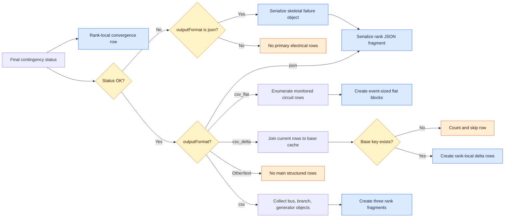

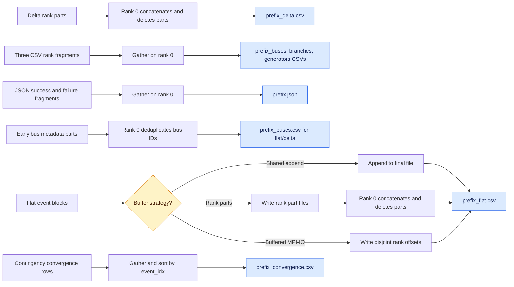

### 5.1 Which statuses get which data

| Event outcome | Physical electrical rows | `_convergence.csv` row | Status code |
|---|---:|---:|---|
| Converged, slack within capacity | Eligible; filters/joins can yield zero | Yes | `OK` |
| Converged, slack over capacity | No | Yes | `SLACK_OVERLOAD` |
| Multiple islands, including a simultaneous setup failure | No | Yes | `ISLANDED` |
| Missing element or no valid slack, when not also islanded | No | Yes | `NO_SLACK` |
| Solver failed or did not converge | No | Yes | `DIVERGED` |

JSON serializes a skeletal failure object containing convergence metadata and
empty electrical-result collections. Ordinary CSV has no representation of a
failed event in its three primary files. Flat/delta likewise contribute no main
rows for failed events. With `writeStats=true`, `ISLANDED`, `NO_SLACK`, and
`DIVERGED` also receive zero-valued masked statistic columns; the
`SLACK_OVERLOAD` branch does not add that failure column. The universal
convergence sidecar is the authoritative list of
processed event IDs and status codes. For an event that skips `solve()` entirely
(`ISLANDED` or `NO_SLACK`), the current code does not reset the stored numerical
convergence summary before recording the row; its convergence flag, iterations,
tolerance, and mismatch fields can therefore be stale from an earlier solve.
Interpret the status code—not those numerical fields—for such events.
For `SLACK_OVERLOAD`, the discrepancy is different: the JSON failure object
forces `converged=false`, while the convergence sidecar copies the successful
Newton summary unchanged and can therefore say `converged=true` alongside the
`SLACK_OVERLOAD` status. Again, status is authoritative for final acceptance.

The convergence sidecar contains contingencies 1 through N; it has no row for
flat output's event-0 base case.

### 5.2 Output-format paths

| `outputFormat` | Completed primary files | Base-case treatment |
|---|---|---|
| `csv_flat` (default) | `<prefix>_flat.csv`, `<prefix>_buses.csv`, `<prefix>_convergence.csv` | Event 0 rows use rate A; each successful contingency uses selected A/B/C rating with B→A and C→B→A fallback. |
| `csv_delta` | `<prefix>_delta.csv`, `<prefix>_buses.csv`, `<prefix>_convergence.csv` | No standalone base event; base and contingency values are joined side by side on `(from_bus,to_bus,circuit_id)`. Missing base keys are counted and skipped. |
| `csv` | `<prefix>_buses.csv`, `<prefix>_branches.csv`, `<prefix>_generators.csv`, `<prefix>_convergence.csv` | Rank 0 appends base rows and then gathered contingency fragments; use a fresh prefix, as described below. |
| `json` | `<prefix>.json`, `<prefix>_convergence.csv` | Structured base object is written in the JSON header. |
| Other/text | Always `<prefix>_convergence.csv`; optional per-case `.out` and statistic `.txt` files | No main structured CSV path. |

`csv_flat` on `groupSize=1` directly visits every local `PFBranch` and every
physical circuit ID, calculates complex power from the endpoint voltages, and
sets an out-of-service/isolated circuit's flow to zero. It applies the allowlist
or area/kV reporting filter, calculates MVA loading and the violation flag with
the same selected rating, formats a whole event block, and then uses one of
three paths. Setting the retained diagnostic environment variable
`GRIDPACK_FLAT_LEGACY` bypasses this direct traversal and restores the older
string-based capture path.

- **Shared append (default):** world rank 0 creates the header, all ranks pass a
  barrier, then independent `std::ofstream`s append event blocks to the same
  final file. There is no MPI ordering or lock around an event block, so C++
  does not guarantee cross-process atomicity; a parallel/network filesystem can
  interleave or corrupt blocks. Per-rank parts or buffered MPI-IO avoid that
  portability risk.
- **Per-rank parts:** each rank writes its own part; rank 0 streams the parts
  into the final file and removes them.
- **Buffered MPI-IO:** each rank holds its blocks in memory, all ranks exchange
  byte counts, and each writes to a disjoint final-file offset after the header.

For `csv_flat`, when `overlapIO=true` and output is not kept entirely in memory,
a single background thread drains each rank's FIFO of complete event blocks.
This can overlap disk writing with the next solve, at the cost of an unbounded
queue if the producer persistently outruns storage. `csv_delta` uses a synchronous
`std::ofstream`; `overlapIO` does not apply to it.

For `csv_delta`, each successful case serializes current bus/branch strings,
looks up the same circuit in the rank-local base cache, and writes base/current
flows, loading, voltages, and angles on one row. Parts are concatenated by rank 0.

For `csv`, each rank collects structured bus/branch/generator objects, formats
three string fragments, and sends them to rank 0. JSON uses the same structured
objects but gathers serialized JSON fragments.

That structured path has an important `groupSize>1` limitation. `collectResults()`
visits only a rank's active partition, and the base object written by world rank
0 is never gathered from the other task-group members, so the CSV/JSON base case
contains only rank 0's partition. Contingency CSV fragments from all members do
combine into one full set of physical rows. JSON instead preserves each member's
serialization as a separate object: a successful event appears as `groupSize`
partial objects, and a failure as duplicate skeletal objects. The default and
wave-required `groupSize=1` avoids all of these structured-output limitations.

The ordinary `csv` base writer opens its three files in append mode rather than
truncating them. Reusing an output prefix can therefore accumulate results from
an earlier run. Reusing a prefix previously used by flat/delta is especially
unsafe: structured bus rows can be appended beneath the incompatible flat/delta
bus-metadata header. Use a new prefix or remove/move the old structured CSVs
before an ordinary-CSV run.

For flat/delta, the early bus metadata parts are always merged on rank 0 and
deduplicated by bus number. For every output format, local convergence rows are
gathered on rank 0, sorted by `event_idx`, and written with convergence flag,
iteration count, final tolerance, worst P/Q mismatch bus and magnitude, and
status code.

Main-result row order is not generally event order: the task manager is dynamic,
and shared append, rank-part concatenation, and rank-fragment gathering preserve
rank/write order. Flat, delta, and convergence CSVs carry `event_idx`; use it as
their stable identity, and note that ordinary CSV and JSON contain no event
index. The convergence CSV is explicitly sorted. Only the flat path explicitly
quotes contingency names as CSV fields; commas/newlines in names or circuit
metadata can be ambiguous in other CSV paths.

`printCalcFiles=true` (the default) additionally creates one `<contingency>.out`
file per contingency, not for base event 0. Names are neither sanitized nor made
unique, so slashes and duplicate names are unsafe; they are also interpolated by
`sprintf` into a 128-byte buffer without a length bound, making an overlong name
an overflow risk. `writeStats=true` creates `vmag.txt`, `vmag_mm.txt`, `vang.txt`,
`vang_mm.txt`, `pgen.txt`, `pgen_mm.txt`, `qgen.txt`, `qgen_mm.txt`,
`pflow.txt`, `pflow_mm.txt`, `line_flt_cnt.txt`, `qflow.txt`, `qflow_mm.txt`,
`perf_mm.txt`, and `perf_sum.txt`; CA Q-limit checking also adds
`pq_change_cnt.txt`. Neither option changes the electrical solution or CSV
result-selection decisions.

Temporary `<prefix>_buses.<rank>.part`, optional
`<prefix>_flat.<rank>.part`, and `<prefix>_delta.<rank>.part` files are removed
after their normal rank-0 merge. They can remain after an abort or interrupted
run, as can a precreated flat header.

Source: flat/delta capture and writer setup in
[`ca_driver.cpp`](src/applications/contingency_analysis/ca_driver.cpp#L643),
finalization in [`ca_driver.cpp`](src/applications/contingency_analysis/ca_driver.cpp#L2710),
and [`AsyncRowWriter`](src/applications/contingency_analysis/ca_async_writer.hpp).

## 6. Where accuracy and speed are affected

### Accuracy protections and boundaries

- The base case must converge before any outage is considered.
- Fast assembly calls the same component mismatch/Jacobian formulas as the full
  mapper; only placement into CSR is different.
- Eligibility rejects known structural/topology mismatches, and optional live
  validation fails closed on assembly disagreement.
- Accelerated convergence uses the actual nonlinear mismatch, not correction
  size or the old chord model.
- Nonconverged, non-finite, and controller-changing accelerated cases, plus
  preparation/solve/screen/overlay failures before emission, are rerun by the
  complete per-contingency path, which may itself skip Newton for an invalid or
  islanded setup; a stalled GPU state is not written. A cleanup exception is
  post-emission, so the current output is kept rather than rerun.
- Output overlay/cleanup and retained-first ordering attempt to restore mutable
  network state and mark the rank unhealthy after damage. This is containment,
  not a guarantee: even if the outer base restore fails, pending exact fallbacks
  still run.
- Warm starts and factor reuse can change the iteration path and floating-point
  order, so satisfying the same tolerance does not imply bit-identical CPU/GPU
  results. NVIDIA likewise notes that default cuDSS execution is not inherently
  bitwise reproducible ([cuDSS general description](https://docs.nvidia.com/cuda/cudss/general.html)).
- Current boundaries that can affect parity are the absent post-wave remote-
  regulation hook, the two independently configured Q-limit flags, and the
  ignored return value of a contingency's driver-requested second Q-limit solve.
- The ordinary solver records final mismatch and makes controller decisions
  before mapping its newest pending correction, does not retest afterward, and
  treats reaching the iteration cap as failure even if that iteration's measured
  mismatch meets tolerance. Those are accuracy/reporting boundaries independent
  of GPU arithmetic.

### Speed mechanisms and their tradeoffs

- Rank 0 of each task group parses the RAW text into network objects; network
  partitioning then distributes the live objects and records. Group-size 1
  avoids within-case communication but replicates the complete network on every
  world rank.
- Dynamic task claims reduce idle ranks, while bounded waves limit reserved work
  and snapshot memory. Cross-rank completion/output order becomes nondeterministic.
- The linear-time bridge pass avoids repeated full topology mutation for simple
  recognized outages. Screen misses and N-k events still pay the authoritative
  topology probe.
- The persistent assembler reuses the mapper, CSR pattern, scatter slots, and
  connectivity map across waves. This requires rejecting any case whose reduced
  structure changes.
- Local YBus repair touches only the opened circuit and endpoint buses instead
  of rebuilding the entire network.
- One cuDSS symbolic analysis is amortized across a wave. Numerical cases remain
  sequential and still perform host/device transfers.
- Chord mode replaces repeated expensive factorizations with cheaper triangular
  solves, but takes more nonlinear iterations and can pay both GPU work and a
  complete CPU redo when it stalls.
- The base and irregular fallback tail stay on CPU in wave mode because their
  one-off GPU setup is not amortized.
- Direct flat-row formatting, event-sized writes, shared append, optional
  background writing, and buffered MPI-IO reduce formatting/final-concatenation
  cost. Their costs are respectively more specialized code, possible block
  interleaving/corruption from unlocked cross-process append, queue memory, or
  potentially large rank-local buffers.
- `warmStart=true` often reduces accelerated iterations by starting from the
  solved base, but changes the numerical trajectory relative to the per-case
  RAW-voltage reset. Wave snapshots always store two doubles per bus per case,
  whichever starting-state policy is selected.
- `writeStats=false` avoids per-case string extraction/parsing, distributed
  `StatBlock` storage, and 15–16 final text reductions; `printCalcFiles=false`
  avoids detailed per-contingency text I/O. Monitor filters can dramatically
  reduce flat/delta row formatting and storage. These are I/O/work-volume
  switches, not different power-flow equations.

## 7. Primary source map

| Concern | Current implementation |
|---|---|
| Entry/config, base gate, events, scheduling, fallbacks, CSV finalization | [`src/applications/contingency_analysis/ca_driver.cpp`](src/applications/contingency_analysis/ca_driver.cpp) |
| RAW selection, network initialization, full Newton/controller solve, contingency apply/restore | [`src/applications/modules/powerflow/pf_app_module.cpp`](src/applications/modules/powerflow/pf_app_module.cpp) |
| PSS/E v33 parsing example | [`src/parser/PTI33_parser.hpp`](src/parser/PTI33_parser.hpp) |
| DataCollection-to-network graph construction | [`src/parser/base_parser.hpp`](src/parser/base_parser.hpp) |
| Eligibility, fixed CSR, direct component assembly, snapshots/overlays | [`src/applications/modules/powerflow/pf_batch_ca_assembler.hpp`](src/applications/modules/powerflow/pf_batch_ca_assembler.hpp) |
| Exact and chord wave Newton loops | [`src/applications/modules/powerflow/pf_batch_ca.hpp`](src/applications/modules/powerflow/pf_batch_ca.hpp) |
| Connectivity/bridge screen | [`src/applications/modules/powerflow/pf_screen.hpp`](src/applications/modules/powerflow/pf_screen.hpp) |
| cuDSS workspace and host/device transfers | [`src/math/cudss/cudss_batched_solver.hpp`](src/math/cudss/cudss_batched_solver.hpp) |
| Optional asynchronous block writer | [`src/applications/contingency_analysis/ca_async_writer.hpp`](src/applications/contingency_analysis/ca_async_writer.hpp) |
| Ordinary CSV/JSON serialization | [`src/utilities/results_exporter.cpp`](src/utilities/results_exporter.cpp) |
| Distributed statistics and text summaries | [`src/analysis/stat_block.cpp`](src/analysis/stat_block.cpp), [`src/analysis/stat_block.hpp`](src/analysis/stat_block.hpp) |
